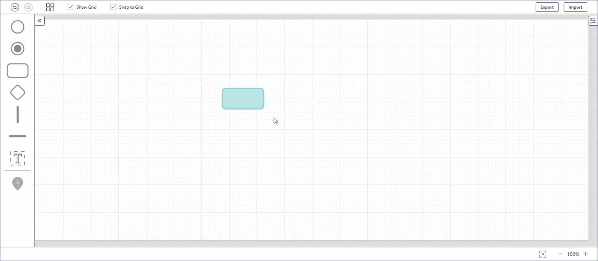

# 1. Introduction
Flowrigami is a workflow editor, designed to visualize diverse workflows and configure them using graphic components.
The main goal of the Flowrigami is to help you to easily integrate BPM methodology into your business.
Flowigami is provided as an embedded component, that can be configured according to your needs.

# 2. General Description.

Main parts of the Flowrigami components are:
* Active Sheet
* Library
* Top Toolbar
* Bottom Toolbar
* Properties Panel
  

## 2.1 Active Sheet

Active Sheet is an area, where you can create and work with you flowchart. You can navigate through the Active Sheet by dragging it with the **right mouse button**.

If your flowchart is leaving the borders of the Active Sheet, Active Sheet will be automatically expanded.

## 2.2 Library

The Library contains available Nodes for your flowchart. It is used to add new elements to the Active Sheet.

When not needed, the Library can be hidden by clicking the button in the top of the panel. To make the Library appear again, click this button one more time.

## 2.3 Top Toolbar

Top Toolbar contains:
* the **Undo** and **Redo** buttons;
* the **Autolayout** button;
* the **Show Grid** checkbox;
* the **Snap to Grid** checkbox;
* the **Import** button;
* the **Export** button.

## 2.4 Bottom Toolbar

Bottom Toolbar contains:
* the **Center Workspace** button;
* the **Scaling Tool**.
  

For detailed information about the elements listed above see the “Work with Layout” section.

## 2.5 Properties Panel

Properties Panel contains the ID of the selected Node and text window, allowing to edit text, written in the selected Node.

When not needed, the Properties Panel can be hidden by clicking the button in the top of the panel. To make the Properties Panel appear again, click this button one more time.

For detailed information about the text editing see the “Work with Text” section.

# 3. Work with Layout
In the process of creating or editing of the flowchart, the necessity to move or scale the layout may appear. For your convenience, this and other functionality for Layout control is provided by Flowrigami.

## 3.1 Layout Moving

To move the entire Active Sheet, drag it with the **right mouse button** and drop when you want to stop the movement.

## 3.2 Layout Scaling

In order to change the scale of the Layout, click the **+** or **-** button on the Bottom Toolbar. Also, the current scale is indicated between the buttons.

In order to reset the scale to 100%, click the **Center Workspace** button on the Bottom Toolbar.

## 3.3 Autolayout

If you want to place your flowchart in the centre of the Active Sheet, you can use the **Autolayout** button.

Clicking it moves your flowchart the way, that places it’s geometrical centre in the middle of the Active Sheet.

## 3.4 Grid

Grid is made for the convenience of Nodes placing. The grid consists of large cells, divided into small cells. Each large grid cell has 6 small cells both in width and in length.

You can turn the grid on and off by selecting or deselecting the **Show Grid** checkbox on the Top Toolbar.

## 3.5 Snap to Grid

Snap to Grid function enables automatic placement of Nodes to the nearest intersection in the grid (even if the grid is not visible). It allows you to place Nodes of the flowchart more evenly.

You can turn the **Snap to Grid** on and off by selecting or deselecting the Snap to Grid checkbox on the Top Toolbar.

# 4. Work with Nodes
Nodes are basic elements of the flowchart. In Flowrigami you can add Nodes to the Active Sheet, move Nodes within the Active Sheet, delete previously added Nodes, connect Nodes with a Connection Lines.

## 4.1 Node Adding

In order to add a new Node to the Active Sheet, choose one of the Nodes from the Library. When you hover one of the Nodes in the Library with the cursor, this Node becomes highlighted with the corresponding colour. This is the same colour that the node will have on the Active Sheet.

To add the chosen Node to the Active Sheet, drag and drop it from the Library to the place you want it to be located.

## 4.2 Node Selecting

You can select one of the previously added Nodes in order to see it’s ID, edit the text in this Node or delete this Node.

To select the Node, click it with the **left mouse button**. 

Selected Node has altered border colour and Anchor Points visible.

## 4.3 Node Moving

In order to move a Node within the Active Sheet, drag and drop it from the initial location to the location you want to place it.

If you have the Snap to Grid function turned on, Node will be moved by steps, “snapped” to the nearest intersection in the grid.

If you have the Snap to Grid function turned off, the Node can be placed freely.

## 4.4 Nodes Connecting

Nodes of flowchart are normally connected with arrows, or Connection Lines in Flowrigami.

When you hover or select any Node, the Anchor Points appear.

Click one of the Anchor Points of the Node and drag cursor to the Anchor Point of another Node. Connection Line will follow the cursor to the destination Anchor Point.

Connection Line is linked to both initial and destination Anchor Points. If you move one of the Nodes, Connection Line follows the anchor point and automatically rebuilds itself.

If you want to change the shape of the Connection Line, hover or select it. You will see the Anchor Points of this Connection Line. Drag and drop these  Anchor Points to new positions. Each Connection Line segment has 3 Anchor Points.

If you have reshaped the Connection Line manually, it will not be automatically rebuilt, when the  Nodes it is connected to are moved.

## 4.5 Node Deletion

If you want to delete a Node from the Active Sheet, select this Node and press the **Delete** button on your keyboard.

## 4.6 Indicator Node

Special kind of Nodes in Flowrigami is an Indicator Node.

It serves for real-time display of some values, transferred through the API from the system to which you have the Flowrigami component integrated into.

Indicator Node can also have different colours.

# 5. Work with Text

Nodes of flowchart can be provided with text notes. There are two types of text notes in Flowrigami:
* Text, connected to the Node
* Text Block

## 5.1 Text in Nodes

In order to edit text linked to the Node, open the Properties Panel and select the Node you want to work with.

Enter desired text in the text window on the Properties Panel. When you are typing, text will appear in or near the Node, depending on the Node type. To save changes in the text, click any place of your Active Sheet.

Another way to edit text linked to the Node is to double-click the corresponding Node. You will see the line and cursor for text appear in or near the Node, depending on the Node type. To save changes in the text, click any place of your Active Sheet.

Note, that text linked to the Node has limited displayed length. If your text is longer, it will be fully displayed only when you select corresponding Node.

## 5.2 Text Block

Text Block can be located in any place of the Active Sheet. Drag and drop it from the Library to the desired location.

Then you can edit text in it using Properties Panel or by double-click, the same way as for text in Nodes.

Unlike the text in Nodes, Text block do not have the length limitation.

# 6. File Export
If you have finished you work or if you want to save the current work progress, you can export your flowchart as a JSON file for further use. 
To do this, hover the **Export** button on the Top Toolbar.

Hovering it brings up a drop-down menu. Select the **Export as JSON** item from the menu. JSON file with your flowchart will be automatically saved or you will be offered to choose destination folder on your PC, depending on your browser settings.

If you want to save the picture of your flowchart, select **Export as PNG** item from the menu. PNG file with your flowchart will be automatically saved or you will be offered to choose destination folder on your PC, depending on your browser settings.

# 7. File Import
In order to continue work with previously saved as JSON flowchart, hover the **Import** button on the Top Toolbar.

Hovering it brings up a drop-down menu. Select the **Import JSON** item from the menu. Select JSON file with your flowchart on your PC and open it.

# 8. View Mode and Edit Mode
Flowrigami works in two modes: View and Edit.
In Edit Mode the full range of Flowrigami functions are available. You can create, edit and view the flowcharts.

In View Mode functions are limited. You can only view flowcharts.

Library, Properties Panel, Top Toolbar are disabled. 
Nodes selecting is disabled.

You can change the Layout scale and move the Layout.

